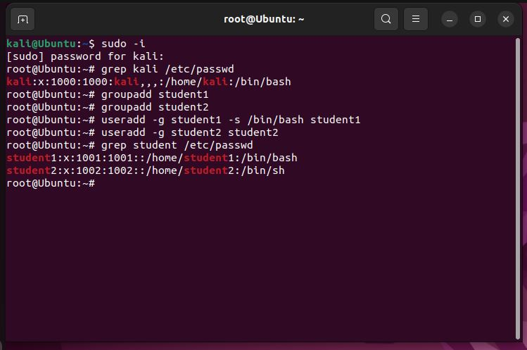
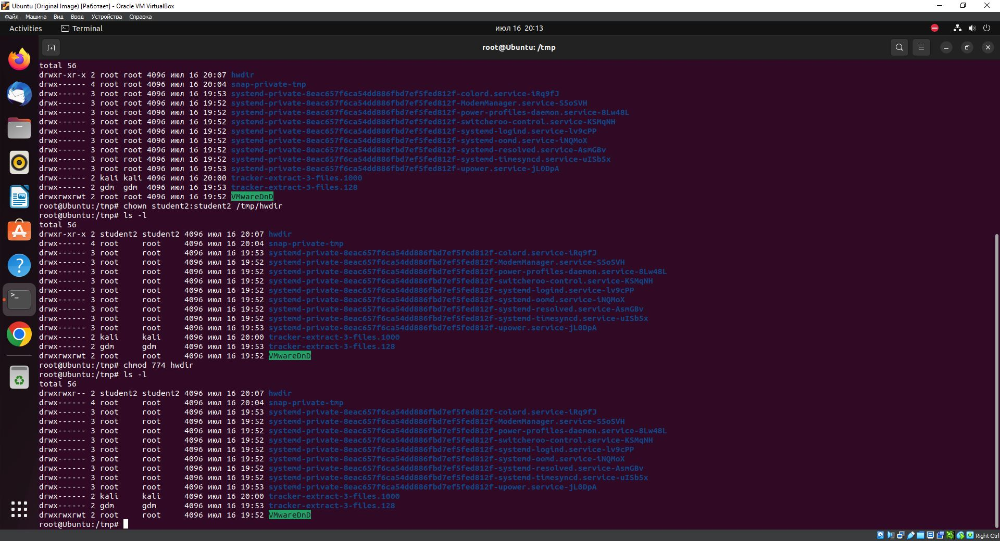
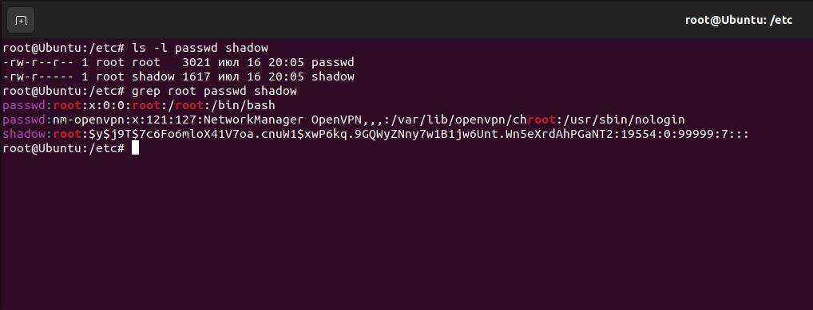

# Домашнее задание к занятию «Linux Hardening»

В качестве результата пришлите ответы на вопросы в личном кабинете студента на сайте [netology.ru](https://netology.ru/).

## 

### Задание 1

- Создайте пользователя `student1` с оболочкой bash, входящего в группу `student1`.
- Создайте пользователя `student2`, входящего в группу `student2`.

*Дайте ответ в виде снимков экрана.*

------

### Задание 2

- Создайте в общем каталоге, например, /tmp, директорию.
- Назначьте для неё полный доступ со стороны группы `student2` и доступ на чтение всем остальным.

*Дайте ответ в виде снимков экрана.*

------

### Задание 3

- Определите, какой режим доступа установлен для файлов `/etc/passwd` и `/etc/shadow`.
- Объясните, зачем понадобилось именно два файла.

*Дайте ответ в виде снимков экрана.*

В файле `passwd` хранятся данные учетных записей пользователей и этот файл доступен для чтения всем пользователям, ведь он содержит лишь информацию о том, установлен ли для определенной учетной записи пароль для входа в систему. В файле же `shadow` помимо прочих данных хранятся пароли пользователей в хешированом виде. Идея заключается в том, чтобы сделать файл `/etc/passwd` доступным для чтения всем пользователям, не сохраняя в нем зашифрованные пароли, а затем сделать `/etc/shadow` файл доступен для чтения только root или другим привилегированным программам, которым требуется доступ к этой информации. Примером такой программы может быть программа входа в систему.

------

### Задание 4*

Изучите информацию о SELinux из открытых источников.

Ответьте на вопросы:

- Что из того, что предлагает SELinux, может быть реализовано в стандартном Linux? Практическая ценность SELinux состоит в том, что стандартная система контроля доступа порой недостаточна. Если SELinux отключен, то вам доступна только классическая дискреционная система контроля доступа, которая включает в себя DAC (избирательное управление доступом) или ACL(списки контроля доступа). То есть речь идет о манипулировании правами на запись, чтение и исполнение на уровне пользователей и групп пользователей, чего в некоторых случаях может быть совершенно недостаточно
- Можно ли установить SELinux поверх существующей ОС Linux? SELinux доступен с коммерческой поддержкой как часть Red Hat Enterprise Linux начиная с версии 4.
В сообществе поддерживаемые дистрибутивы Linux:
- CentOS
- Debian
- ArchLinux (неофициально)
- Fedora Core начиная с версии 2
- Hardened Gentoo
- openSUSE начиная c версии 11.1
- Ubuntu
- ROSA
- ALT Linux СПТ 6
Мобильная ОС Android поддерживает SELinux начиная с версии 4.3. Начиная с версии 5.0, распространители Андроида должны включать SELinux в режиме Enforcing.

*Дайте ответ в свободной форме.*

SELinux (SELinux) — это система принудительного контроля доступа, реализованная на уровне ядра. Впервые эта система появилась в четвертой версии CentOS, а в 5 и 6 версии реализация была существенно дополнена и улучшена. Эти улучшения позволили SELinux стать универсальной системой, способной эффективно решать массу актуальных задач. Стоит помнить, что классическая система прав Unix применяется первой, и управление перейдет к SELinux только в том случае, если эта первичная проверка будет успешно пройдена.
В самом начале своего появления SELinux была реализована в виде патча. В данном случае было непросто настраивать политику безопасности. С появлением механизмов LSM, настройка и управление безопасностью значительно упростились (политика и механизмы усиления безопасности были разделены), SELinux была реализована в виде подгружаемых модулей ядра. Перед доступом к внутренним объектам операционной системы производится изменение кода ядра. Это реализуется при помощи специальных функций (перехватчиков системных вызовов), так называемых функций «хуков» (англ. hook functions). Функции-перехватчики хранятся в некоторой структуре данных, их целью является выполнение определенных действий по обеспечению безопасности, основанных на заранее установленной политике. Сам модуль включает в себя шесть главных компонентов: сервер безопасности; кэш вектора доступа (англ. Access Vector Cache, AVC); таблицы сетевых интерфейсов; код сигнала сетевого уведомления; свою виртуальную файловую систему (selinuxfs) и реализацию функций-перехватчиков.

------